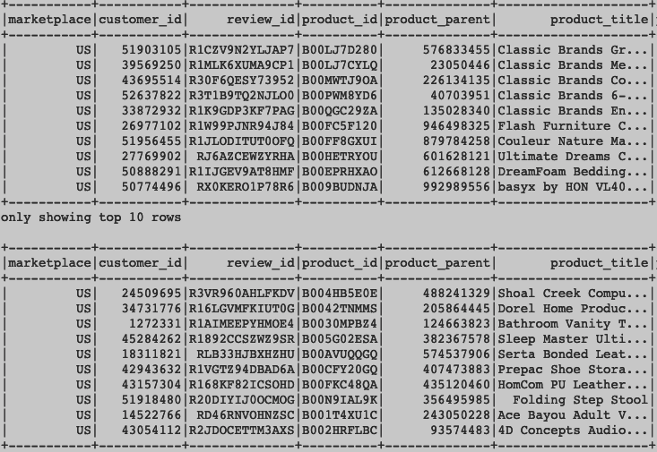

# Alphabet Soup ML Neural Net Venture Predictor

 

## Description

AlphabetSoupMLNN is a Neural Net machine learning model that predicts the success of a venture paid by Alphabet soup. The trained model is used to determine the future decisions of the company—only projects and how likely these ventures are to be a success. It will therefore predict which projects will receive any future funding from Alphabet Soup.

Alphabet soup is a philanthropic foundation that aims at supporting endeavors that protect the environment, improve individual well being, and unify the world. It has donated over 10B dollars for life saving technologies and reforestation groups. 

## Objectives

The objectives for this project is analyze the impact of each donation so that the foundation’s money is being used effectively. Train a deep learning net work evaluate all types of input data and predict a clear decision result. The NN needs to predict which donations are worth donating to and which are too high risk

* Import, analyze, clean, and preprocess a “real-world” classification dataset.
* Select, design, and train a binary classification model of your choosing.
* Optimize model training and input data to achieve desired model performance.

## Technologies Used:
* Python
* Tensorflow
* Pandas
* Sklearn
* Jupyter Notebook
* Os

## Analysis

#### How many neurons and layers did you select for your neural network model? Why?
In in beginning of the I seleted 3 hidden layers with 8, 8, 6, neurons each. This produced an accuracy of ~0.70. I then increased the number of hidden layers to 4, and the number of neurons to 8, 8, 6, 6. This gave me a 2% incrase in accruacy at ~0.72. I wanted to test how far I could go to incrase my accuracy; therefore, I now have 9 hidden layers with 24, 18, 18, 12, 12, 8, 8, 6, 6 neurons. This produced an accuracy betwwen 0.72 - 0.74.

#### Were you able to achieve the target model performance? What steps did you take to try and increase model performance?

Most of my efforts for this projectwas in Data Preprocessing, where I had to Bin/Bucket + Encode or Drop columns. The steps that increased my model performance was when I dropped the EIN and Name column, since they were unique identifiers and did not contribute to the overall accruacy. I had to also frequently revise the the range within the bins/buckets for Income Amount, Classification, and Application Type, where I decreased a number of inputs in order to decrease variability and outliers. 

#### If you were to implement a different model to solve this classification problem, which would you choose? Why?

I would choose a random forest as the different model to solve this classification problem. This is because, first Random Forest are are binary classification model, which is what our output requires. Second, Random Forests are more robust and scalable and all of our data are tabular data, where we do not have data such as images or natural language data.We do not need Neural networks' ability to handle all sorts of data types and structures. 
